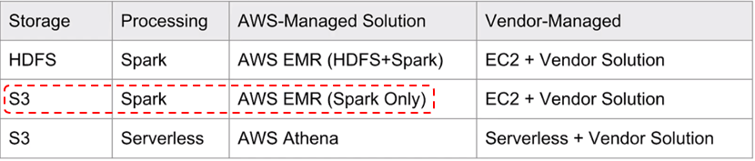
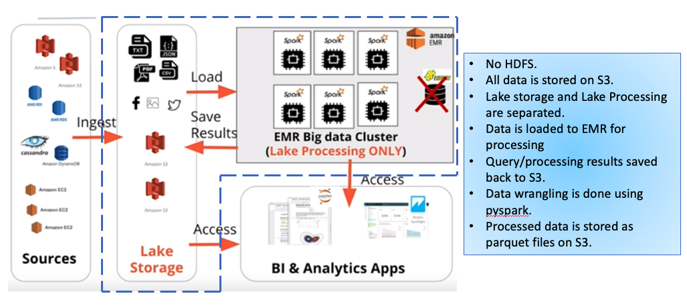

### Udacity Data Engineering Nanodegree
#Project 4: Data Lakes with Apache Spark 

#####  

## Introduction

Sparkify, a music streaming app startup, wants to leverage songs and user data that they have been collecting from the app by analyzing and finding relevant patterns. In particular, the analytics team wants to know what are the songs that the users are listening to. However, within the current setup, it is difficult to make sense of the data. In recent times, the app has grown its user base as well as song database and want to move their processes and data onto the cloud. Up until now, their data resides in Amazon s3 Bucket, in directory of JSON logs on user activity on the app, as well as a directory with JSON metadata on the songs in their app, which is not suitable for quering at all. 

#####  


## Goal

The goal of this project is to create an ETL pipeline that extracts data from S3, stages and processes them using Apache Spark, and transforms data into a set of dimensional tables and loads them back to S3 for the analytics team to continue finding insights in what songs their users are listening to.

#####  


## Project Scope

### Datasets
For this project, you'll be working with two datasets that reside in S3. Here are the S3 links for each:

- Song data: `s3://udacity-dend/song_data`
- Log data: `s3://udacity-dend/log_data`
  - Log data json path: `s3://udacity-dend/log_json_path.json`

#### Song Dataset
The first dataset is a subset of real data from the [Million Song Dataset](https://labrosa.ee.columbia.edu/millionsong/). Each file is in JSON format and contains metadata about a song and the artist of that song. The files are partitioned by the first three letters of each song's track ID. For example, here are filepaths to two files in this dataset.

`song_data/A/B/C/TRABCEI128F424C983.json`
`song_data/A/A/B/TRAABJL12903CDCF1A.json`

And below is an example of what a single song file, `TRAABJL12903CDCF1A.json`, looks like.

```
{"num_songs": 1, "artist_id": "ARJIE2Y1187B994AB7", "artist_latitude": null, "artist_longitude": null, "artist_location": "", "artist_name": "Line Renaud", "song_id": "SOUPIRU12A6D4FA1E1", "title": "Der Kleine Dompfaff", "duration": 152.92036, "year": 0}
```

#### Log Dataset
The second dataset consists of log files in JSON format generated by this [event simulator](https://github.com/Interana/eventsim) based on the songs in the dataset above. These simulate app activity logs from an imaginary music streaming app based on configuration settings.

The log files in the dataset you'll be working with are partitioned by year and month. For example, here are filepaths to two files in this dataset.

`log_data/2018/11/2018-11-12-events.json`
`log_data/2018/11/2018-11-13-events.json`

Below is an example of what the data in a log file, `2018-11-12-events.json`, looks like.


You can find all the zipped data in the [data folder](data). You might as well extract it to your working
directory as it will be required in a further step. 


#####  


## Schema Design 

We have designed the following Star Schema after analyzing both the song data and log data. [Note: Field in bold are the partition keys] 


#####  


## Project Structure
* **etl.py**: The script reads song_data and load_data from S3, transforms them to create five different tables, and writes them to partitioned parquet files in table directories on S3.
* **schema.py**: The script captures the column names as per star-schema design.
* **dl.cfg**: Contains credentials for accessing S3.
* **Apache_Spark_Project.ipynb**: Notebook for trying things out locally before putting them into a script.
* **data**: A sample of song_data and log_data saved locally for testing before going to S3.
* **images**: Images used for this readme file


#####  


## Technology 

We have multiple options to create Data Lakes in AWS. We have to decide: 
a)Type of Storage b) the processing engine and c) AWS-Managed solution or a Vendor managed solution.

In this project, we will be using the **dotted red line** : **Processing Engine: Apache Spark, Managed solution: Amazon EMR, and Storage Type: S3.** Here is a depiction of the options:  



* **Lake Storage**: S3
* **Lake Processing**: Spark 


### Project workflow 

The **blue dotted line** represents the scope and workflow of this project.




## Project Steps

* ### Create a IAM User for the API

First, Log in to AWS console to create a new user with programmatic access at the IAM section.
For detailed instructions, please go to this link [here](https://docs.aws.amazon.com/IAM/latest/UserGuide/id_users_create.html#id_users_create_console).

Pay attention to the Review section and copy down your new **access key ID** and **secret access key** at [dl.cfg](dl.cfg)
```
[AWS]
AWS_ACCESS_KEY_ID = ******** (change for yours)
AWS_SECRET_ACCESS_KEY = ******** (change for yours)
```

* ### Create a S3 Bucket 
Create a S3 Bucket and folder to get and store the processed data from Amazon EMR. Remember, the output folder should be empty. Use the default configuration for the S3 bucket creation process. Once the bucket and folder is created modify the appropriate input_data/output_data in the main function of the `etl.py` script. 

* ### Create an Amazon EC2 Key Pair
The next step is to create an Amazon Elastic Compute Cloud (Amazon EC2) key pair to connect to the nodes in your cluster over a secure channel using the Secure Shell (SSH) protocol. If you don't have a key pair, follow one of the following procedures depending on your operating system:
* [Creating Your Key Pair Using Amazon EC2](https://docs.aws.amazon.com/AWSEC2/latest/WindowsGuide/ec2-key-pairs.html#having-ec2-create-your-key-pair) in the Amazon EC2 User Guide for Windows Instances
* [Creating Your Key Pair Using Amazon EC2](https://docs.aws.amazon.com/AWSEC2/latest/UserGuide/ec2-key-pairs.html#having-ec2-create-your-key-pair) in the Amazon EC2 User Guide for Linux Instances. Use this procedure for Mac OS as well.

* ### Setting up an EMR Cluster in AWS 
There are several ways to create EMR Cluster: AWS Console, AWS CLI or directly from python. Here we called our cluster `My-cluster`, but you can choose any name you like. Also, remember to use the EC2 key pair you created some steps before. 
* **Troubleshooting tips:** If you are using windows 10 and Ubuntu - a linux distribution for windows to connect to Amazon EC2 instances using EC2 key pair .prem file, you may get **Permission Denied: public Key** error. To resolve the issue, please read [Connecting to Amazon EC2 Instance on Windows 10 bash - Permission denied (publickey)](https://stackoverflow.com/questions/39038729/connecting-to-amazon-ec2-instance-on-windows-10-bash-permission-denied-public) 
 
If you need help setting up the cluster, read the [getting started documentation](https://docs.aws.amazon.com/emr/latest/ManagementGuide/emr-gs.html). 
If you want to install Amazon EMR using AWS CLI, read the [Create EMR using AWS CLI](https:://knowledge.udacity.com/questions/239069)

Here is a look at the cluster setup from AWS Console: 


The cluster will take around 15 minutes to start. Once it is working, you must copy down your master node's public IP and follow the next step to access it.

* ### Enable SSH access to your cluster with a Security Group
Security groups act as virtual firewalls to control inbound and outbound traffic to EMR cluster. Using AWS web-interface, find the security group your `master` node is referring to and grant inbound access from
your IP at port 22. This is a two step process. 

Step 1: Keep ssh session alive [keep ssh session alive](https://stackoverflow.com/questions/25084288/keep-ssh-session-alive)

Step 2: Authorize Inbound Traffic [Authorize Inbound Traffic] (https://docs.aws.amazon.com/emr/latest/ManagementGuide/emr-connect-ssh-prereqs.html)

Step 3: Connect to the Master Node Using SSH [Connect to the Master Node Using SSH] (https://docs.aws.amazon.com/emr/latest/ManagementGuide/emr-connect-master-node-ssh.html). 

Remember to use this following command: 
```
ssh hadoop@ec2-###-##-##-###.compute-1.amazonaws.com -i ~/mykeypair.pem

```
If you are successful, you will get a terminal something like this: 


### Run `etl.py` in the cluster
If you are able to access the cluster, the next step is to run the elt.py. Open another terminal, copy etl.py and dl.cfg from local drive to /home/username. Then copy these files to EMR Master node using these commands with `scp` as below:  
```bash
scp -i mykeypair.pem etl.py hadoop@**.***.***.**:/home/hadoop
scp -i mykeypair.pem dl.cfg hadoop@**.***.***.**:/home/hadoop
```

Make sure that both of the are copied to the master node. Now, in the terminal where you accessed your EMR cluster, simply run:
```bash
spark-submit etl.py
```

* **Troubleshooting Tips: ** The elt.py file is written in python 3.x whereas for Amazon EMR release versions 4.6.0-5.19.0: Python 3.4 is installed on the cluster instances but Python 2.7 is the system default. To solve this issue, please go to [How do I configure Amazon EMR to run a PySpark job using Python 3.4 or 3.6?] (https://aws.amazon.com/premiumsupport/knowledge-center/emr-pyspark-python-3x/)


### Understand your ETL pipeline
The script will take around 40 minutes to perform all the operations in it. Here is the summary of how our ETL pipeline works when running `etl.py`:

1. We load all the parameters in `dl.cfg` including our AWS credentials. 
2. A spark session is created in order for the cluster to receive tasks.
3. Data is read from the bucket at `s3://input/song-data` as a dataframe to work with, then it is transformed and stored back again in S3 as parquet.file

We expect to get the dimensional tables are ready in parquet format, which will allow faster computations in the cluster for querying big data.


### Analyze your ETL performance with Spark UI

Step 01: Setup a SSH tunnel. Follow this instructions here [Set Up an SSH Tunnel to the Master Node Using Dynamic Port Forwarding](https://docs.amazonaws.cn/en_us/emr/latest/ManagementGuide/emr-ssh-tunnel.html). Before doing this step, make sure that you have setup your inbound traffic rules properly on your master node. See above for detailed instructions. 

```
ssh -i ~/mykeypair.pem -N -D 8157 hadoop@ec2-###-##-##-###.compute-1.amazonaws.com.cn
```
Step 02: Configure Proxy Settings to View Websites Hosted on the Master Node [ Configure SwitchyOmega for Chrome](https://docs.amazonaws.cn/en_us/emr/latest/ManagementGuide/emr-connect-master-node-proxy.html)

Step 03: Go to the Amazon EMR Console, select the appropriate cluster and the from the home page, select **Application User Interfaces** tab. Here you will find a list of user interface URL. Select Spark History Server: 

```
http://ec2-**.***.***.**.****.compute.amazonaws.com:18080/
```

Once in the UI, you should be able to see how your EMR cluster ran your ETL script with spark in different nodes, just as in the image below:


### Clean Up Resources
Congratulations, you just deployed an ETL pipeline with Spark. Remember to delete your S3 bucket and EMR cluster in order to avoid unexpected costs.
#####  

## Results 
If everything goes smooth, you should get the following folders in your s3 Bucket: 


Also, each of the folder should have .parquet files like these: 


#####  

## Sample Queries 

If you want to run queries to check the tables created, please run [query to test analytics](query.ipynb). Here is one of the sample queries:

* **Query one**
```
#top ten users in the dataframe 
query = """
SELECT songplays.user_id, users.gender, users.level, songplays.location, COUNT(*) total 
FROM songplays 
JOIN users  
ON songplays.user_id = users.userId
GROUP BY songplays.user_id, users.gender, users.level, songplays.location
ORDER BY total DESC 
LIMIT 10
"""
top_users_df = spark.sql(query).toPandas()

```


## Running the project in Google Colab for testing
If you want to run the project in a local server, which is highly recommended as becasue it is rather difficult and time consuming to debug pyspark errors, there is a jupyter notebook included in this project [Apache Spark in Google Colab](Apache_Spark_Project.ipynb). This notebook includes all necessary information to setup and run Apache Spark in colab along with the project implementation. This is a free cloud service, which makes it easier to try and debug with smaller subset of the data


## Additional Resources 

* **Spark & Data Lake Issues:** This amazing medium post describes different issues with creating, navigating and other related staffs. Have a look at it [Spark & Data Lake Issues](https://towardsdatascience.com/some-issues-when-building-an-aws-data-lake-using-spark-and-how-to-deal-with-these-issues-529ce246ba59). Especially Tip 9 - How to speed up the ETL pipeline and Tip 11 - Don’t let AWS Billing Dashboard confuse you

* **Getting Started with Amazon EMR:** This blogpost is a great starting place to learn about Amazon EMR and related services. Check this out! [Getting Started with Amazon EMR](https://aws-dojo.com/workshoplists/workshoplist34/)


 